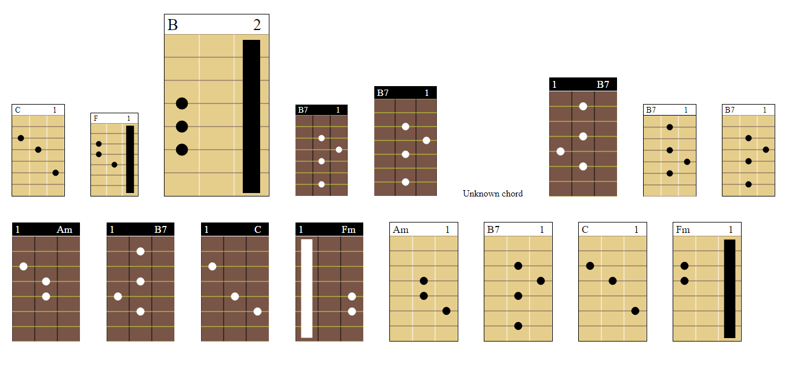

# Chord web component

Small widget for displaying of guitar chords at your website

## Getting Started

**Warning!** 

``` <single-chord></single-chord> ``` tag and *chord* attribute is deprecated in 0.0.2. Now use ```<chord-creator></<chord-creator>``` and *chords*.




You can just copy **chords.js** or **chords-min.js** from **/build** into your js directory import script and insert **<chord-creator chord="C"></chord-creator>** into your html

### Installing

Copy **chords.js** or **chords-min.js** into your **js** directory.


Add ```<chord-creator chords="C"></chord-creator>``` and import script **chords.js** or **chords-min.js** at the bottom of body in HTML file:

```
<html>
  <body>
    <chord-creator chords="C"></chord-creator>
    <script src="./your-location/chord-min.js"></script>
  </body>
</html>
```

Also you can run **npm i chords-web-component --save** and import script as : ``` <script src="./node_modules\chords-web-component\build\chord-min.js"></script> ```


Detailes you can read at [USERGUIDE.md](USERGUIDE.md)

## Built With

- [Web components](https://developer.mozilla.org/en-US/docs/Web/Web_Components) - The web tool used

## Versioning

Changelog [CHANGELOG](CHANGELOG.md).

I use [Github](https://github.com/) for versioning. For the versions available, see the [Chord-Web-Component](https://github.com/okedo/chords-web-component).

## Authors

- **Viktor Patraboi** - main work - [okedo](https://github.com/okedo)

See also the list of [contributors](https://github.com/okedo/chords-web-component/graphs/contributors) who participated in this project.

## License

This project is licensed under the MIT License - see the [LICENSE.md](LICENSE.md) file for details
